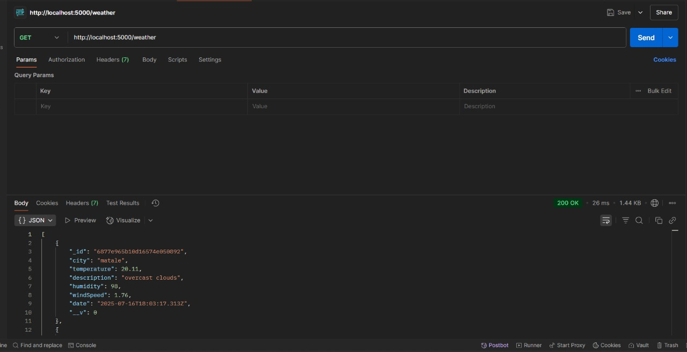
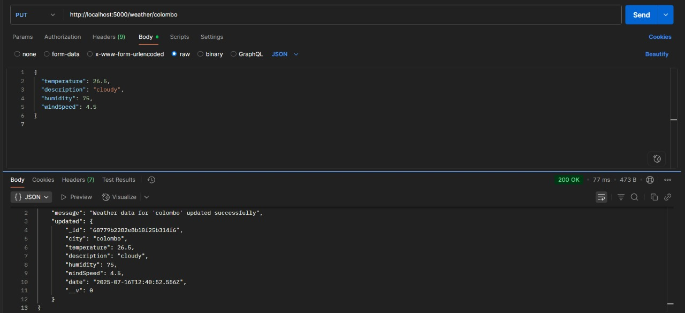

#Weather App (Node.js + MongoDB)

A backend project that fetches real-time weather data from OpenWeatherMap API and stores it in MongoDB. Provides RESTful APIs to Create, Read, and Delete weather data.

##Tech Stack

- **Node.js** – Backend runtime
- **Express.js** – API server framework
- **MongoDB** – NoSQL database
- **Mongoose** – MongoDB ORM
- **Axios** – API client
- **dotenv** – Environment variable management
- **Postman** – API testing tool

## Project Structure


### ⚙️ Setup Instructions

### 1. Clone this repo:

```bash
   git clone https://github.com/kishan-ctrl/Weather-app.git
   cd weather-app 
```
### 2. Initialize the Node.js Project
```bash
   npm init -y
```

### 4.Install Required Dependencies
```bash
   npm install express mongoose axios dotenv
```
### 5.Install Dev Dependencies
```bash
   npm install nodemon --save-dev
```
### 6. start the server  

```bash
   node server.js
```

API Endpoints
POST/weather
Description: Fetch and save weather data for a city from OpenWeatherMap
Request Body
```bash
   { "city": "matale" }
```
Success response
```bash
   {
  "_id": "...",
  "city": "matale",
  "temperature": 28,
  "description": "clear sky",
  "humidity": 80,
  "windSpeed": 3.4,
  "date": "..."
}
```
Postman


GET/weather
Description:  Retrieve all stored weather data
```bash
   http://localhost:5000/weather
```
Success response
Postman



GET/weather/:city
Description:Get weather data for a specific city
```bash
   http://localhost:5000/weather/trincomalee
```
Success response
```bash
   {
    "_id": "687797ba82e8b10f25b314ef",
    "city": "trincomalee",
    "temperature": 30.1,
    "description": "overcast clouds",
    "humidity": 67,
    "windSpeed": 7.4,
    "date": "2025-07-16T12:14:50.731Z",
    "__v": 0
}
```
Postman


PUT/weather/:city
HTTP URL
```bash
   http://localhost:5000/weather/colombo
```
Description: Manually update weather data in MongoDB
Request Body
```bash
   {
  "temperature": 26.5,
  "description": "cloudy",
  "humidity": 75,
  "windSpeed": 4.5
}
```
Success response
```bash
   {
    "message": "Weather data for 'colombo' updated successfully",
    "updated": {
        "_id": "68779b2282e8b10f25b314f6",
        "city": "colombo",
        "temperature": 26.5,
        "description": "cloudy",
        "humidity": 75,
        "windSpeed": 4.5,
        "date": "2025-07-16T12:40:52.556Z",
        "__v": 0
    }
}
```
Postman



