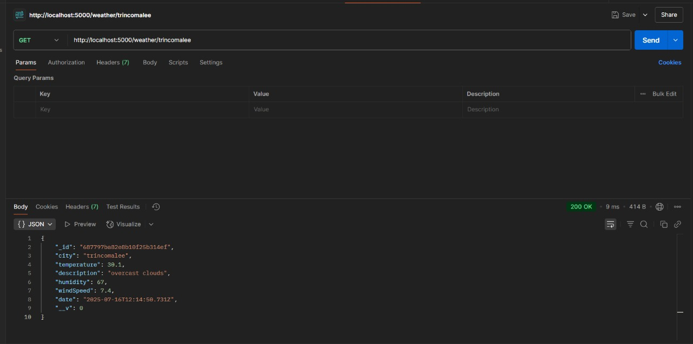

# Weather App (Node.js + MongoDB)

A backend project that fetches real-time weather data from the OpenWeatherMap API and stores it in MongoDB. This application provides RESTful APIs to create, read, update, and delete weather data for different cities.

## Features

-   Fetch real-time weather data from OpenWeatherMap.
-   Store weather data in a MongoDB database.
-   RESTful API endpoints for CRUD operations.
-   Scalable and well-structured project layout.

## Tech Stack

-   **Backend Runtime:** Node.js
-   **API Framework:** Express.js
-   **Database:** MongoDB
-   **ORM:** Mongoose
-   **API Client:** Axios
-   **Environment Variables:** dotenv
-   **API Testing:** Postman

## Setup and Installation

Follow these steps to get the project up and running on your local machine.

### Prerequisites

-   Node.js (v14 or later)
-   MongoDB instance (local or cloud-based like Atlas)
-   A free API key from [OpenWeatherMap](https://openweathermap.org/api)

### 1. Clone the Repository

Clone the project to your local machine.

```bash
git clone https://github.com/kishan-ctrl/Weather-app.git
cd Weather-app
```

### 2. Initialize the Project

If you haven't already, initialize the npm project.

```bash
npm init -y
```

### 3. Install Dependencies

Install the required packages for the application to run.

```bash
npm install express mongoose axios dotenv
```

Install the development dependencies (like `nodemon` for auto-reloading).

```bash
npm install --save-dev nodemon
```

### 4. Configure Environment Variables

Create a `.env` file in the root of your project directory. Add your MongoDB connection string and OpenWeatherMap API key.

```env
MONGO_URI=your_mongodb_connection_string
API_KEY=your_openweathermap_api_key
PORT=5000
```

### 5. Start the Server

Run the server using `nodemon` for development, which automatically restarts the server on file changes.

```bash
npx nodemon server.js
```

Alternatively, you can start the server with the standard Node.js command:

```bash
node server.js
```

The server will start on the port defined in your `.env` file (e.g., `http://localhost:5000`).

## API Endpoints

The following are the available API endpoints for interacting with the weather data.

---

### `POST /weather`


**Description:** Fetches weather data for a specified city from OpenWeatherMap and saves it to the database.

**Request Body:**

```json
{
  "city": "Matale"
}
```

**Success Response (`201 Created`):**

```json
{
    "_id": "...",
    "city": "matale",
    "temperature": 28,
    "description": "clear sky",
    "humidity": 80,
    "windSpeed": 3.4,
    "date": "..."
}
```

---

### `GET /weather`


**Description:** Retrieves all stored weather data records from the database.

**Example URL:** `http://localhost:5000/weather`

**Success Response (`200 OK`):**

```json
[
    {
        "_id": "687797ba82e8b10f25b314ef",
        "city": "trincomalee",
        "temperature": 30.1,
        "description": "overcast clouds",
        "humidity": 67,
        "windSpeed": 7.4,
        "date": "2025-07-16T12:14:50.731Z",
        "__v": 0
    },
    {
        "_id": "68779b2282e8b10f25b314f6",
        "city": "colombo",
        "temperature": 26.5,
        "description": "cloudy",
        "humidity": 75,
        "windSpeed": 4.5,
        "date": "2025-07-16T12:40:52.556Z",
        "__v": 0
    }
]
```

---

### `GET /weather/:city`



**Description:** Retrieves weather data for a specific city by its name.

**Example URL:** `http://localhost:5000/weather/trincomalee`

**Success Response (`200 OK`):**

```json
{
    "_id": "687797ba82e8b10f25b314ef",
    "city": "trincomalee",
    "temperature": 30.1,
    "description": "overcast clouds",
    "humidity": 67,
    "windSpeed": 7.4,
    "date": "2025-07-16T12:14:50.731Z",
    "__v": 0
}
```

---

### `PUT /weather/:city`

**Description:** Manually updates the weather data for a specific city in the database.

**Example URL:** `http://localhost:5000/weather/colombo`


**Request Body:**

```json
{
  "temperature": 26.5,
  "description": "cloudy",
  "humidity": 75,
  "windSpeed": 4.5
}
```

**Success Response (`200 OK`):**

```json
{
    "message": "Weather data for 'colombo' updated successfully",
    "updated": {
        "_id": "68779b2282e8b10f25b314f6",
        "city": "colombo",
        "temperature": 26.5,
        "description": "cloudy",
        "humidity": 75,
        "windSpeed": 4.5,
        "date": "2025-07-16T12:40:52.556Z",
        "__v": 0
    }
}
```
