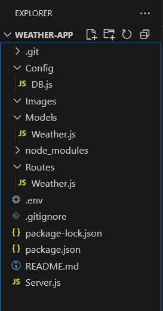
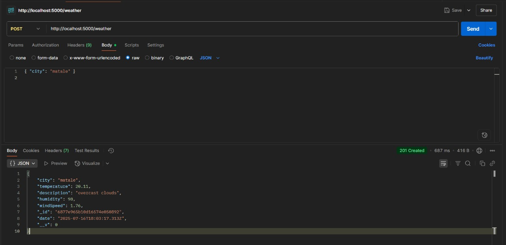

#Weather App (Node.js + MongoDB)

A backend project that fetches real-time weather data from OpenWeatherMap API and stores it in MongoDB. Provides RESTful APIs to Create, Read, and Delete weather data.

##Tech Stack

- **Node.js** – Backend runtime
- **Express.js** – API server framework
- **MongoDB** – NoSQL database
- **Mongoose** – MongoDB ORM
- **Axios** – API client
- **dotenv** – Environment variable management
- **Postman** – API testing tool

## Project Structure




### ⚙️ Setup Instructions

### 1. Clone this repo:

```bash
   git clone https://github.com/kishan-ctrl/Weather-app.git
   cd weather-app 
```
### 2. Initialize the Node.js Project
```bash
   npm init -y
```

### 4.Install Required Dependencies
```bash
   npm install express mongoose axios dotenv
```
### 5.Install Dev Dependencies
```bash
   npm install nodemon --save-dev
```
### 6. start the server  

```bash
   node server.js
```

API Endpoints

Description: Fetch and save weather data for a city from OpenWeatherMap
Request Body
```bash
   { "city": "matale" }
```
Success response
```bash
   {
  "_id": "...",
  "city": "matale",
  "temperature": 28,
  "description": "clear sky",
  "humidity": 80,
  "windSpeed": 3.4,
  "date": "..."
}
```
POST Method



